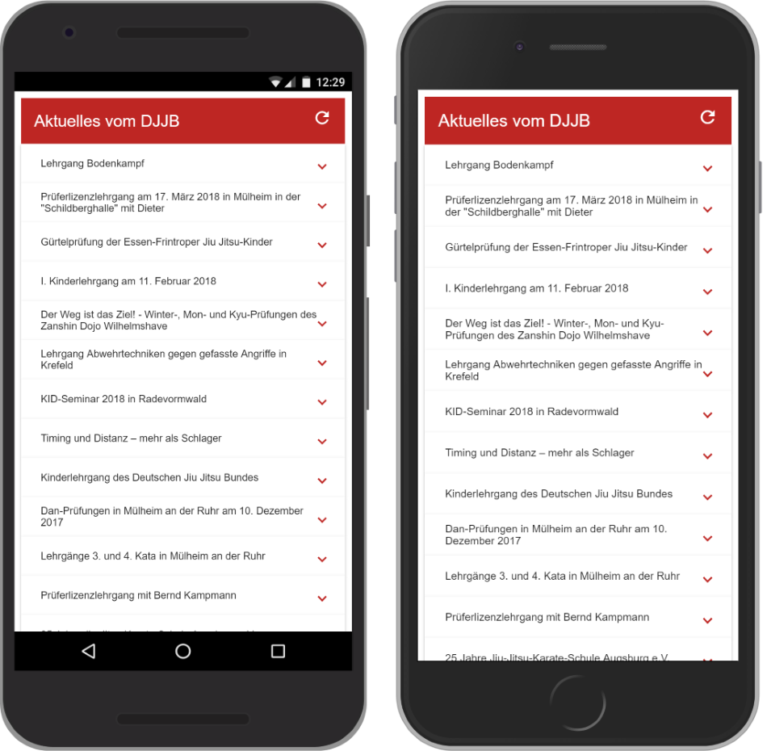

[](https://opensource.org/licenses/MIT)
<a href="https://twitter.com/ckruhs">
        </a>

# DJJB News Reader

This is a Progressive Web App to display the [News Feed](https://www.DJJB.de/index.rss) of the German Jiu Jitsu Federation / [Deutscher Jiu Jitsu Bund](https://www.DJJB.de) (DJJB) on mobile devices. In addition, the course plan can be viewed and online registrations can be made.

Watch the App live on your mobile device here: https://www.DJJB.de/news-reader

Since the App displays a german speaking RSS Feed, the user interface is displayed in German.





## Getting Started
The project was created with [Visual Studio Code](https://code.visualstudio.com/) and the [Angular CLI](https://github.com/angular/angular-cli) Version 8.2.

These instructions will get you a copy of the project up and running on your local machine for development purposes.

### Set up the Development Environment
You need to set up your development environment first. See [Angular Getting Started Guide](https://angular.io/start) for further information.

Install [Node.js® and npm](https://nodejs.org/en/download/) if they are not already on your machine.

```
Verify that you are running at least Node.js version 10.x or greater and npm version 6.x or greater by running node -v and npm -v in a terminal/console window. Older versions produce errors, but newer versions are fine.
```

Then install the Angular CLI globally:
```
npm install -g @angular/cli
```

### Get the Code
Download or clone the repo: 
```
git clone https://github.com/ckruhs/djjb-news-reader.git
```
To clone the repo, Git must of course be installed on the local computer. To set up Git please see [Set Up Git](https://help.github.com/articles/set-up-git/) for details.


### Install Project dependencies
Install the necessary dependencies from the project root folder:
```
cd djjb-news-reader
npm install
```
(This will install the dependencies declared in the package.json file)

### Development server
Run the dev server:
```
ng serve
```

Navigate to [http://localhost:4200/](http://localhost:4200/). The app will automatically reload if you change any of the source files.

### Development vs Production Builds
The production build (`ng build --configuration=production`) applies performance optimizations that may result in differences compared to the development build:

- **Google Fonts Handling**: In development, fonts are loaded using external link tags. In production, the Angular build process inlines these fonts as CSS `@font-face` declarations directly in the HTML file. This is intentional and improves performance by reducing render-blocking resources.
- Other optimizations include minification, tree-shaking, and ahead-of-time (AOT) compilation.

These differences are expected and beneficial for production performance.

## Acknowledgments
The [BeCompany news reader tutorial](https://github.com/becompany/angular2-rss-reader-tutorial) was a good starting point for the project and some code parts were taken over.


## License
This project is licensed under the MIT License - see the [LICENSE.txt](LICENSE.txt) file for details.

DJJB News Reader uses several third-party libraries. More information can be found in [THIRD-PARTY-NOTICES.txt](docs/THIRD-PARTY-NOTICES.txt).

## Contributing
See the [Guidelines for Contributing](docs/CONTRIBUTING.md)
