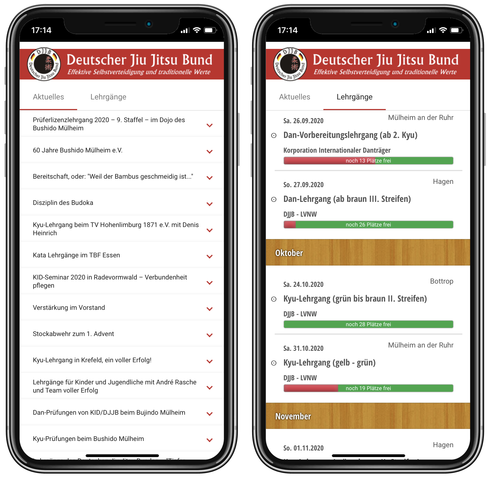

# DJJB News Reader

This is a Web App to display the [News Feed](https://www.DJJB.de/index.rss) of the German Jiu Jitsu Federation / [Deutscher Jiu Jitsu Bund](https://www.DJJB.de) (DJJB) on mobile devices.

Watch the App live on your mobile device here: https://www.DJJB.de/news-reader

Since the App displays a german speaking RSS Feed, the user interface is displayed in German.





## Getting Started
The project was created with [Visual Studio Code](https://code.visualstudio.com/) and the [Angular CLI](https://github.com/angular/angular-cli) Version 1.7.4.

These instructions will get you a copy of the project up and running on your local machine for development purposes.

### Set up the Development Environment
You need to set up your development environment first. See [Angular QuickStart Guide](https://angular.io/guide/quickstart) for further information.

Install [Node.js® and npm](https://nodejs.org/en/download/) if they are not already on your machine.

```
Verify that you are running at least node 6.9.x and npm 3.x.x by running node -v and npm -v in a terminal/console window.
```

Then install the Angular CLI globally:
```
npm install -g @angular/cli
```

### Get the Code
Download or clone the repo: 
```
git clone https://github.com/ckruhs/djjb-news-reader.git
```
To clone the repo, Git must of course be installed on the local computer. To set up Git please see [Set Up Git](https://help.github.com/articles/set-up-git/) for details.


### Install Project dependencies
Install the necessary dependencies from the project root folder:
```
cd djjb-news-reader
npm install
```
(This will install the dependencies declared in the package.json file)

### Development server
Run the dev server:
```
ng serve
```

Navigate to [http://localhost:4200/](http://localhost:4200/). The app will automatically reload if you change any of the source files.

## Credits
- https://github.com/becompany/angular2-rss-reader-tutorial
- https://github.com/cubiq/add-to-homescreen


## License
This project is licensed under the MIT License - see the [LICENSE.txt](LICENSE.txt) file for details.

djjb-news-reader uses several third-party libraries. More information can be found in [THIRD-PARTY-NOTICES.txt](docs/THIRD-PARTY-NOTICES.txt).

## Contributing
See the [Guidelines for Contributing](docs/CONTRIBUTING.md)
